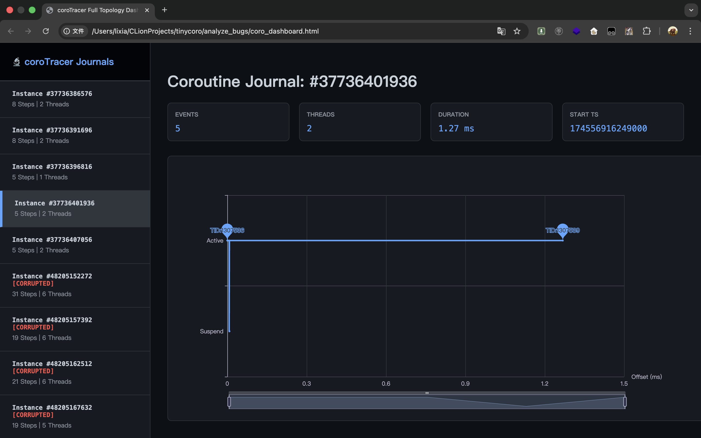

# coroTracer: 跨语言、零拷贝的协程可观测性工具


![zread](https://img.shields.io/badge/Ask_Zread-_.svg?style=flat&color=00b0aa&labelColor=000000&logo=data%3Aimage%2Fsvg%2Bxml%3Bbase64%2CPHN2ZyB3aWR0aD0iMTYiIGhlaWdodD0iMTYiIHZpZXdCb3g9IjAgMCAxNiAxNiIgZmlsbD0ibm9uZSIgeG1sbnM9Imh0dHA6Ly93d3cudzMub3JnLzIwMDAvc3ZnIj4KPHBhdGggZD0iTTQuOTYxNTYgMS42MDAxSDIuMjQxNTZDMS44ODgxIDEuNjAwMSAxLjYwMTU2IDEuODg2NjQgMS42MDE1NiAyLjI0MDFWNC45NjAxQzEuNjAxNTYgNS4zMTM1NiAxLjg4ODEgNS42MDAxIDIuMjQxNTYgNS42MDAxSDQuOTYxNTZDNS4zMTUwMiA1LjYwMDEgNS42MDE1NiA1LjMxMzU2IDUuNjAxNTYgNC45NjAxVjIuMjQwMUM1LjYwMTU2IDEuODg2NjQgNS4zMTUwMiAxLjYwMDEgNC45NjE1NiAxLjYwMDFaIiBmaWxsPSIjZmZmIi8%2BCjxwYXRoIGQ9Ik00Ljk2MTU2IDEwLjM5OTlIMi4yNDE1NkMxLjg4ODEgMTAuMzk5OSAxLjYwMTU2IDEwLjY4NjQgMS42MDE1NiAxMS4wMzk5VjEzLjc1OTlDMS42MDE1NiAxNC4xMTM0IDEuODg4MSAxNC4zOTk5IDIuMjQxNTYgMTQuMzk5OUg0Ljk2MTU2QzUuMzE1MDIgMTQuMzk5OSA1LjYwMTU2IDE0LjExMzQgNS42MDE1NiAxMy43NTk5VjExLjAzOTlDNS42MDE1NiAxMC42ODY0IDUuMzE1MDIgMTAuMzk5OSA0Ljk2MTU2IDEwLjM5OTlaIiBmaWxsPSIjZmZmIi8%2BCjxwYXRoIGQ9Ik0xMy43NTg0IDEuNjAwMUgxMS4wMzg0QzEwLjY4NSAxLjYwMDEgMTAuMzk4NCAxLjg4NjY0IDEwLjM5ODQgMi4yNDAxVjQuOTYwMUMxMC4zOTg0IDUuMzEzNTYgMTAuNjg1IDUuNjAwMSAxMS4wMzg0IDUuNjAwMUgxMy43NTg0QzE0LjExMTkgNS42MDAxIDE0LjM5ODQgNS4zMTM1NiAxNC4zOTg0IDQuOTYwMVYyLjI0MDFDMTQuMzk4NCAxLjg4NjY0IDE0LjExMTkgMS42MDAxIDEzLjc1ODQgMS42MDAxWiIgZmlsbD0iI2ZmZiIvPgo8cGF0aCBkPSJNNCAxMkwxMiA0TDQgMTJaIiBmaWxsPSIjZmZmIi8%2BCjxwYXRoIGQ9Ik00IDEyTDEyIDQiIHN0cm9rZT0iI2ZmZiIgc3Ryb2tlLXdpZHRoPSIxLjUiIHN0cm9rZS1saW5lY2FwPSJyb3VuZCIvPgo8L3N2Zz4K&logoColor=ffffff)


> **开发初衷**：在做上一个项目时，我的 M:N 调度器遇到个极其恶心的 Bug。高并发下系统吞吐量会突然掉到零，但 ASAN 和 TSAN 跑出来没有任何内存错误。后来发现这是一个“丢失唤醒（lost wakeup）”问题——协程在一个已经关闭的文件描述符上死等。传统的内存工具查不出这种逻辑层面的状态机断裂。为了揪出这个 Bug，我写了 coroTracer。它通过物理内存布局协议（cTP），把观测平面和执行平面彻底物理隔离。

coroTracer 是一个进程外的 M:N 协程观测工具。它能帮你排查逻辑死锁、状态机断裂和协程泄露问题。

---

## 架构

```text
+-----------------------+                               +-----------------------+
|   Target Application  |                               |    Go Tracer Engine   |
|  (C++, Rust, Zig...)  |                               |                       |
|                       |       [ Lock-Free SHM ]       |                       |
|  +-----------------+  |      +-----------------+      |  +-----------------+  |
|  |  cTP SDK Probe  |=======> | StationData [N] | <=======|  Harvester Loop   |  |
|  +-----------------+  |  Write +-----------------+ Read |  +-----------------+  |
|                       |               ^               |                       |
|       [ Socket ]      |---(Wakeup)---UDS---(Listen)---|      [ File I/O ]     |
+-----------------------+                               +-----------------------+
                                                                        | (Append)
                                                                        v
        +-------------------------+      [ DeepDive ]           +---------------+
        | Interactive HTML Portal | <--- analyzer.go ---------  |  trace.jsonl  |
        +-------------------------+      (Heuristics)           +---------------+
```

---

## 核心机制

核心思路很简单：别让观测工具干扰目标进程。

* **执行平面**：C++/Rust SDK 使用无锁数据结构，直接把状态转换写进预分配的共享内存里。
* **观测平面**：独立的 Go 引擎在后台异步拉取这些 SHM 数据并生成拓扑。这就避开了传统网络插桩带来的开销和上下文切换。

### 技术细节

* **cTP 内存契约**：底层走 `mmap`。强制 1024 字节对齐，跨过不同语言编译器隐式 Padding 差异的坑。
* **64 字节缓存行对齐**：事件槽（Event Slot）精准对齐现代 CPU 的 Cache Line，彻底规避多线程并发写入时的伪共享（False Sharing）。
* **零拷贝**：纯靠指针偏移和硬件级原子指令交换数据。没有 RPC 调用，无序列化开销。
* **智能 UDS 唤醒**：
    * 引擎闲置时，会在共享内存头部设置一个 `TracerSleeping` 标志位。
    * SDK 每次写入前，只做一个极轻量的原子读取（Atomic Load）来检查这个标志位。
    * **只有当**引擎休眠时，SDK 才会发一个 1 字节的 UDS（Unix Domain Socket）信号去唤醒它。这防住了高吞吐下的系统调用风暴。

---

## 快速开始

### 1. 启动引擎

Go 引擎负责分配 SHM 和 UDS，并拉起你的目标程序。

```bash
# 编译观测引擎
go build -o coroTracer main.go

# 运行
./coroTracer -n 256 -cmd "./your_target_app" -out trace.jsonl
```

### 2. 接入 SDK (以 C++20 为例)

目标程序会自动通过环境变量继承 IPC 配置。

```cpp
#include "coroTracer.h"

int main() {
    corotracer::InitTracer(); // 自动完成 mmap 映射与连接
    // ... 启动你的调度器
}
```

让 `promise_type` 继承 `PromiseMixin` 就能无感拦截生命周期：

```cpp
struct promise_type : public corotracer::PromiseMixin {
    // 业务代码... coroTracer 会在底层自动 hook await_suspend / await_resume
};
```

### 3. 生成报告

```bash
# 生成 Markdown 诊断报告 (自动侦测 SIGBUS 和 丢失唤醒)
./coroTracer -deepdive -out trace.jsonl

# 生成交互式 HTML 大屏
./coroTracer -html -out trace.jsonl
```

---

## 实战：抓获“丢失唤醒”

在测试我自己的 [tiny_coro](https://github.com/lixiasky-back/tiny_coro-build_your_own_MN_scheduler) 调度器时，程序在重压下时不时假死。吞吐掉零，但各类 Sanitizer 检查全绿。

挂上 coroTracer 后，报告直接显示有 47 个协程死在了 `Suspended` 状态，指令指针全停在 `co_await AsyncRead(fd)`。

**根本原因：**
爆发 `EOF/RST` 事件时，工作线程正确调用了 `close(fd)`，但**漏掉了**对绑定在该 fd 上的协程调用 `.resume()`。Socket 关了，状态机逻辑断了。这些协程就这么永远困在堆内存里，等一个永远不会来的信号。

* 原始 Trace 日志: [trace.jsonl](example/trace.jsonl)
* 诊断报告: [coro_report.md](example/coro_report.md)
* 看板预览:
  

---

## cTP 内存布局

| 偏移量 | 字段 | 大小 | 说明 |
| :--- | :--- | :--- | :--- |
| `0x00` | `MagicNumber` | 8B | `0x434F524F54524352` |
| `0x14` | `SleepFlag` | 4B | 引擎休眠标志 (1 = Sleeping) |
| `0x40` | `EventSlots` | 512B | 8 个对齐到 64B 的循环缓冲区 |

> 详细规范见 [cTP.md](docs/cTP.md)

---

## 语言支持
目前我提供了一个 C++20 SDK。不过因为核心只依赖严格的内存映射契约，你可以很轻松地为 Rust、Zig 或 C 写个 Probe——基本上支持 `mmap` 的语言都行。

> 欢迎联系我：lixia.chat@outlook.com